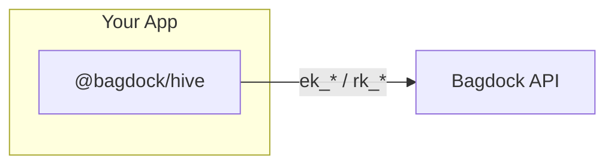
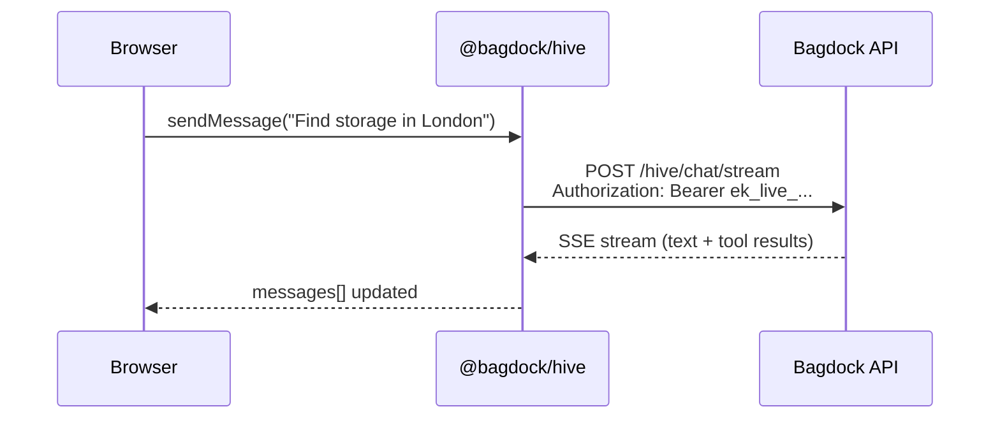
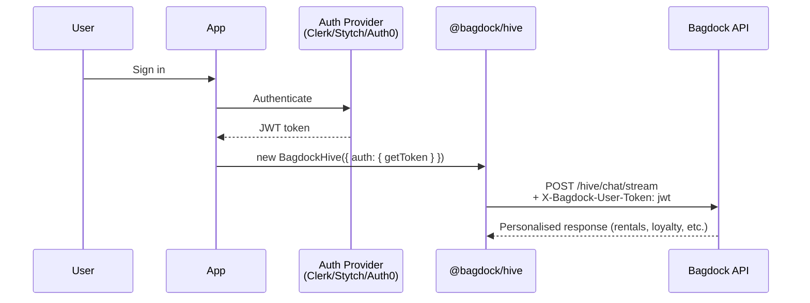
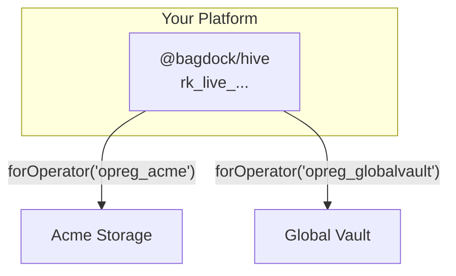

```
  ----++                                ----++                    ---+++     
  ---+++                                ---++                     ---++      
 ----+---     -----     ---------  --------++ ------     -----   ----++----- 
 ---------+ --------++----------++--------+++--------+ --------++---++---++++
 ---+++---++ ++++---++---+++---++---+++---++---+++---++---++---++------++++  
----++ ---++--------++---++----++---+++---++---++ ---+---++     -------++    
----+----+---+++---++---++----++---++----++---++---+++--++ --------+---++   
---------++--------+++--------+++--------++ -------+++ -------++---++----++  
 +++++++++   +++++++++- +++---++   ++++++++    ++++++    ++++++  ++++  ++++  
                     --------+++                                             
                       +++++++                                               
```

# @bagdock/hive

Embeddable AI-powered storage management for your app — streaming chat, pluggable authentication, and multi-tenant operator scoping.

[](https://www.npmjs.com/package/@bagdock/hive)
[](LICENSE)

## Install

```bash
npm install @bagdock/hive
# or
bun add @bagdock/hive
```

## How it works

Your app talks to the Bagdock API through the SDK. The API handles AI responses, tool execution, and data access on your behalf.



## Key types

Bagdock uses a Stripe-style three-tier key model:

| Prefix | Name | Use case | Scopes |
|--------|------|----------|--------|
| `ek_*` | Embed Key | Client-side widgets, iframes | Origin-locked, read-only by default |
| `rk_*` | Restricted Key | Server-side integrations, APIs | Granular scopes, no origin lock |
| `whsec_*` | Webhook Signing Key | Verifying webhook payloads | HMAC-SHA256 signatures |

All keys support `live` and `test` environments:

```typescript
'ek_live_abc123...'  // Production embed key
'ek_test_abc123...'  // Sandbox embed key
```

---

## Use cases

### 1. Quick chat (simplest)

Embed a chat widget in 10 lines. The SDK handles streaming, tool execution, and session management.



```typescript
import { BagdockHive } from '@bagdock/hive'

const hive = new BagdockHive({
  apiKey: 'ek_live_...',
})

const stream = hive.chat.stream({
  messages: [{ role: 'user', content: 'Find storage near King\'s Cross' }],
})
```

### 2. With user authentication

Attach a user identity so the agent can access their rentals, payments, and profile.



```typescript
import { BagdockHive } from '@bagdock/hive'

const hive = new BagdockHive({
  apiKey: 'ek_live_...',
  auth: {
    provider: 'clerk',
    getToken: () => clerk.session?.getToken() ?? '',
  },
})

const stream = hive.chat.stream({
  messages: [{ role: 'user', content: 'Show my upcoming payments' }],
})
```

**Supported providers:** Clerk, Auth0, Stytch, or any custom JWT.

### 3. Operator-scoped (multi-tenant)

Scope all requests to a specific operator — their facilities, pricing, and branding.



```typescript
const hive = new BagdockHive({ apiKey: 'rk_live_...' })

// Scoped to Acme Storage
const acme = hive.forOperator('opreg_acme')
const units = await acme.units.list({ status: 'available' })
const codes = await acme.access.list(unitId)

// Scoped to Global Vault
const vault = hive.forOperator('opreg_globalvault')
const vaultUnits = await vault.units.list()
```

### 4. Server-side with restricted key

Full API access from your backend — manage units, trigger webhooks, read analytics.

```typescript
// Server-side only — never expose rk_* keys to the browser
import { BagdockHive } from '@bagdock/hive'

const hive = new BagdockHive({
  apiKey: process.env.BAGDOCK_RESTRICTED_KEY!, // rk_live_...
})

const units = await hive.units.list({ status: 'available' })
const rental = await hive.units.book({
  unitId: 'unit_abc',
  contactId: 'contact_123',
  moveInDate: '2025-02-01',
})
```

### 5. AI SDK integration (useChat)

Use `HiveChatTransport` with the Vercel AI SDK for seamless `useChat` integration.

```typescript
import { useChat } from '@ai-sdk/react'
import { HiveChatTransport } from '@bagdock/hive'

function ChatPage() {
  const { messages, sendMessage, status } = useChat({
    transport: new HiveChatTransport({
      apiKey: 'ek_live_...',
      operatorId: 'opreg_acme', // optional
    }),
  })

  return (
    <div>
      {messages.map(m => <p key={m.id}>{m.content}</p>)}
      <button onClick={() => sendMessage({ text: 'Find storage' })}>
        Send
      </button>
    </div>
  )
}
```

### 6. Local development

Override the API URL for local testing against a development marketplace API.

```typescript
const hive = new BagdockHive({
  apiKey: 'ek_test_...',
  baseUrl: 'https://abc123.ngrok.io', // or http://localhost:3001
})
```

Or via environment variable (no code change needed):

```bash
BAGDOCK_API_URL=https://abc123.ngrok.io bun run dev
```

> **Note:** Non-HTTPS URLs are blocked when `NODE_ENV=production`.

---

## API reference

### `hive.chat`

| Method | Description |
|--------|-------------|
| `chat.create()` | Start a new chat session |
| `chat.send(sessionId, { message })` | Send a message |
| `chat.stream(params)` | Stream a chat response (SSE) |
| `chat.history(sessionId)` | Get session history |

### `hive.units`

| Method | Description |
|--------|-------------|
| `units.list(params?)` | List units (filter by status, size, location) |
| `units.get(unitId)` | Get unit details |
| `units.book(params)` | Create a rental |

### `hive.access`

| Method | Description |
|--------|-------------|
| `access.list(unitId)` | List access codes for a unit |
| `access.create(params)` | Generate a new access code |
| `access.revoke(codeId)` | Revoke an access code |

### `hive.embedTokens`

| Method | Description |
|--------|-------------|
| `embedTokens.create(params)` | Create a new embed token |
| `embedTokens.validate(token)` | Validate a token |
| `embedTokens.revoke(tokenId)` | Revoke a token |

### Utility exports

| Export | Description |
|--------|-------------|
| `HiveChatTransport` | AI SDK `ChatTransport` for `useChat` integration |
| `BagdockHiveError` | Typed error class with `status`, `code`, `requestId` |
| `detectKeyType(key)` | Returns `'embed'`, `'restricted'`, `'webhook'`, or `'unknown'` |
| `isTestKey(key)` | `true` if key contains `_test_` |
| `isLiveKey(key)` | `true` if key contains `_live_` |

## Configuration

| Option | Type | Default | Description |
|--------|------|---------|-------------|
| `apiKey` | `string` | — | **Required.** Your Bagdock API key (`ek_*` or `rk_*`) |
| `baseUrl` | `string` | `https://api.bagdock.com` | API base URL |
| `maxRetries` | `number` | `3` | Max retries for failed requests |
| `timeoutMs` | `number` | `30000` | Request timeout in milliseconds |
| `auth` | `AuthAdapterConfig` | — | Pluggable auth provider config |

### Auth providers

```typescript
// Clerk
{ provider: 'clerk', getToken: () => clerk.session?.getToken() ?? '' }

// Auth0
{ provider: 'auth0', domain: 'my-app.us.auth0.com', clientId: '...' }

// Stytch
{ provider: 'stytch' }

// Custom JWT
{ provider: 'custom', getToken: async () => myJwt }
```

## Security

- **HTTPS enforced** in production — the SDK throws if a non-`https://` base URL is used when `NODE_ENV=production`
- **Embed keys** (`ek_*`) are origin-locked and safe for client-side use
- **Restricted keys** (`rk_*`) should only be used server-side
- **Never** expose `rk_*` or `whsec_*` keys in client-side code

## License

MIT
